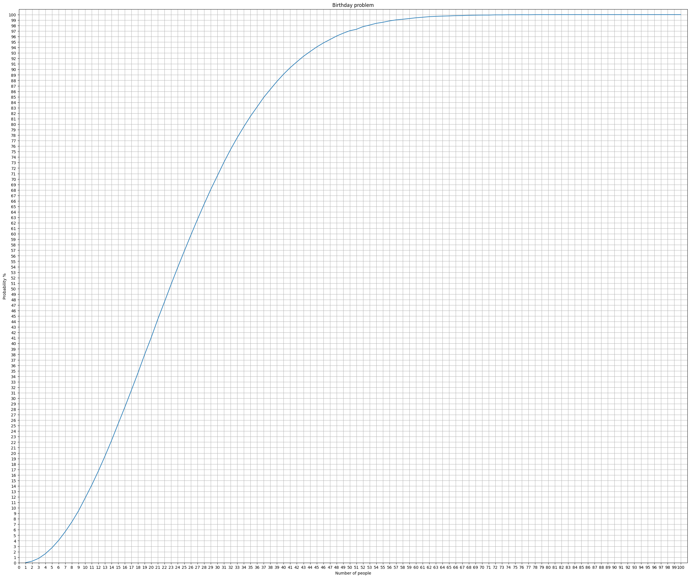

<div align="center">
  <h1>Birthday problem</h1>

  <p>The birthday paradox, also known as the birthday problem written on C</p>

<!-- Badges -->
<p>
  <a href="https://github.com/Qu1nel/Birthday-problem/graphs/contributors">
    
  </a>
  <a href="https://github.com/Qu1nel/Birthday-problem/commits/main">
    
  </a>
  <a href="https://github.com/Qu1nel/Birthday-problem/network/members">
    
  </a>
  <a href="https://github.com/Qu1nel/Birthday-problem/stargazers">
    
  </a>
  <a href="https://github.com/Qu1nel/Birthday-problem/issues/">
    
  </a>
</p>

<p>
  <a href="https://github.com/Qu1nel/Birthday-problem/releases/">
    
  <a>
  <a href="https://github.com/Qu1nel/Birthday-problem/blob/main/LICENSE">
    
  </a>
</p>

<h4>
  <a href="#view-demo">View Demo</a>
  <span> · </span>
  <a href="https://github.com/Qu1nel/Birthday-problem/issues/">Report Bug</a>
  <span> · </span>
  <a href="https://github.com/Qu1nel/Birthday-problem/issues/">Request Feature</a>
</h4>
</div>

<br />

<!-- Table of Contents -->

# Contents

- [About the Project](#about-brithday-problem)
  - [Screenshots](#screenshots)
- [Installation](#installation)
  - [Requirements](#requirements)
- [Documentation](#documentation)
- [Developers](#developers)
- [License](#license)

## About Brithday problem

The birthday paradox, also known as the birthday problem, is the surprisingly high probability that two people have the same birthday, even in a relatively small group of people.

In a group of 70 people, the probability of two people having the same birthday is 99.9%.

But even in a group of everything only out of 23 people, the probability of matching birthdays is 50%

<details>
  <summary><h3 id="screenshots">Screenshot</h3></summary>
  <div align="center">
    
  </div>
</details>

## Installation

```bash
make build
```

### Requirements

gcc 10.0 >=, clang 13.0.0 >=

## Documentation

For full help with make commands, you can use the command:

```bash
make help
```

P.S. In this project use the Print project by https://github.com/Qu1nel/Print

## Developers

- [Qu1nel](https://github.com/Qu1nel)

## License

[MIT](./LICENSE) © [Ivan Kovach](https://github.com/Qu1nel/)

This Project Qu1nel.Birthday-problem in distributive under the **[MIT License](./LICENSE)**, and it also uses those codes that are distributed under the **[MIT License](./LICENSE)**.
